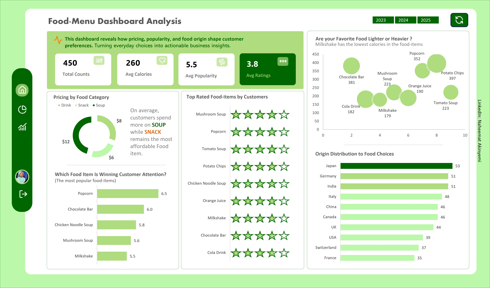
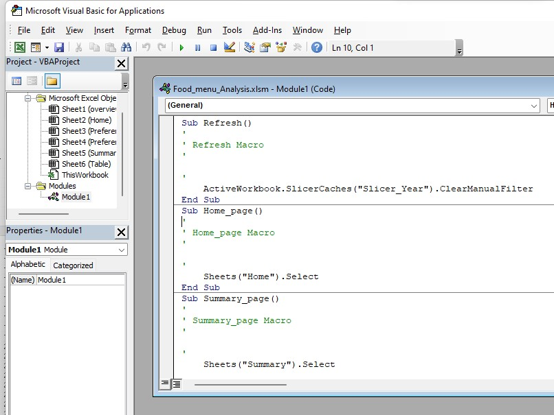
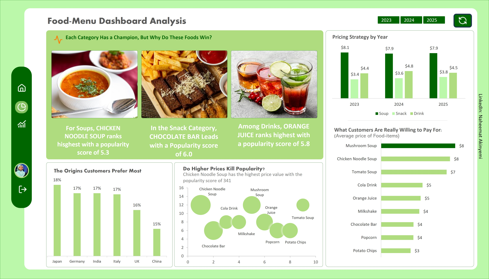

# Food Preference & Pricing Analysis  
An Excel-based food analytics project demonstrating data cleaning, analysis, and visualization to uncover customer preferences, pricing strategies, and product performance.

## Table of Contents
- [Project Overview](#project-overview)  
- [Business Problem](#business-problem)  
- [Tools](#tools)  
- [Exploratory Data Analysis (EDA)](#exploratory-data-analysis-eda)  
- [Data Analysis](#data-analysis)  
- [Key Insights](#key-insights)  
- [Business Value](#business-value)  
- [Recommendations](#recommendations)
- [Dashboard Demo](#dashboard-demo)

## Project Overview
This project analyzes food items across three major categories (**Soup, Snack, Drink**) to understand customer preferences, pricing behavior, and product performance.  

The goal is to transform raw food data into **actionable insights** that support:
- Pricing optimization  
- Product positioning  
- Customer preference analysis  
- Data-driven decision-making  

## Business Problem
The primary challenge is to understand **what drives customer choices** across food categories and how pricing, calories, and origin influence demand.

Specifically, the analysis aims to:
- Identify which food categories customers spend the most on  
- Determine the most popular and highest-rated food items  
- Understand how pricing impacts popularity  
- Analyze calorie distribution across food items  
- Evaluate the influence of food origin on customer preference  

## Tools
- **Microsoft Excel** – Data cleaning, analysis, pivot table, dashboard visualization, and macros.

## Exploratory Data Analysis (EDA)
The exploratory phase focused on answering key questions:

- Which food category is the most expensive on average?  
- Which items are most popular and highly rated?  
- How do calories vary across food categories?  
- Which country origins dominate the dataset?  
- Is there a relationship between price and popularity?  

---

## Data Analysis

### KPIs
- **Total Food Items:** 450  
- **Average Calories:** 260 kcal  
- **Average Popularity Score:** 5.5 / 10  
- **Average Rating:** 3.8 / 5  

### Visualizations Used
- **KPI Cards** – Display key metrics at a glance  
- **Bar Chart** – Compare category performance and top items  
- **Column Chart** – Analyze distribution across categories and origin  
- **Donut Chart** – Show proportional breakdown (e.g., origin distribution)  
- **Bubble Chart** – Explore relationship between price, popularity, and calories  

## Key Insights

- On average, customers spend more on **Soup**, while **Snack remains the most affordable food category**, indicating a **premium vs. convenience consumption pattern**.  

- **Category Leaders (Popularity):**  
  - Drinks: **Orange Juice** ranks highest with a popularity score of **5.8**  
  - Snacks: **Chocolate Bar** leads with a popularity score of **6.0**  
  - Soups: **Chicken Noodle Soup** ranks highest with a popularity score of **5.3**  

- The **highest-rated food item** is **Mushroom Soup (4.0)**, reflecting strong customer satisfaction likely driven by quality and taste.  
  - The **lowest-rated item** is **Cola Drink (3.6)**  

- **Calories Insight:**  
  - Lowest Calories: **Milkshake**  
  - Highest Calories: **Potato Chips**  
  This highlights a wide range of options for both **health-conscious and indulgent consumers**.  

- **Pricing & Popularity Insight:**  
  - **Chicken Noodle Soup** has the highest price (**$12**) and also emerges as the **most popular item** with a score of **341**, showing strong alignment between **price and perceived value**.  
  - In contrast, **Tomato Soup** has the lowest popularity despite a price of **$12**, suggesting **poor value perception or low demand**.  

- **Origin Insight:**  
  - The most dominant food origin is **Japan**, suggesting strong customer preference influenced by **taste and cultural appeal**.  

---

## Business Value

This analysis enables stakeholders to:
- Understand **customer spending behavior across categories**  
- Identify **high-performing and underperforming products**  
- Optimize **pricing strategies for better demand alignment**  
- Leverage **popular food origins and categories**  
- Support **product and marketing decisions with data-driven insights**  

## Problem Identified

- **Low-performing products:** Certain food items show low popularity despite competitive pricing  
- **Pricing mismatch:** Some high-priced items do not translate into higher popularity  
- **Customer perception gap:** Not all premium-priced products deliver perceived value  

## Recommendations

- **Reposition Low-Popularity Products:**  
  Improve visibility, branding, or reformulate offerings to increase appeal  

- **Optimize Pricing Strategy:**  
  Align pricing with customer expectations and perceived value  

- **Incorporate Health Trends:**  
  Introduce or promote **low-calorie options** to attract health-conscious consumers  

---

## Conclusion
This project demonstrates how Excel can be used to transform raw data into meaningful insights to understand **customer behavior, optimize pricing strategies, and improve product performance**.  

## Dashboard Demo  
Click below to explore how the dashboard uncovers insights on pricing, popularity, and customer preferences.

)

By leveraging Excel analytics and visualization techniques, businesses can make **smarter, data-driven decisions** that enhance both customer satisfaction and profitability.
